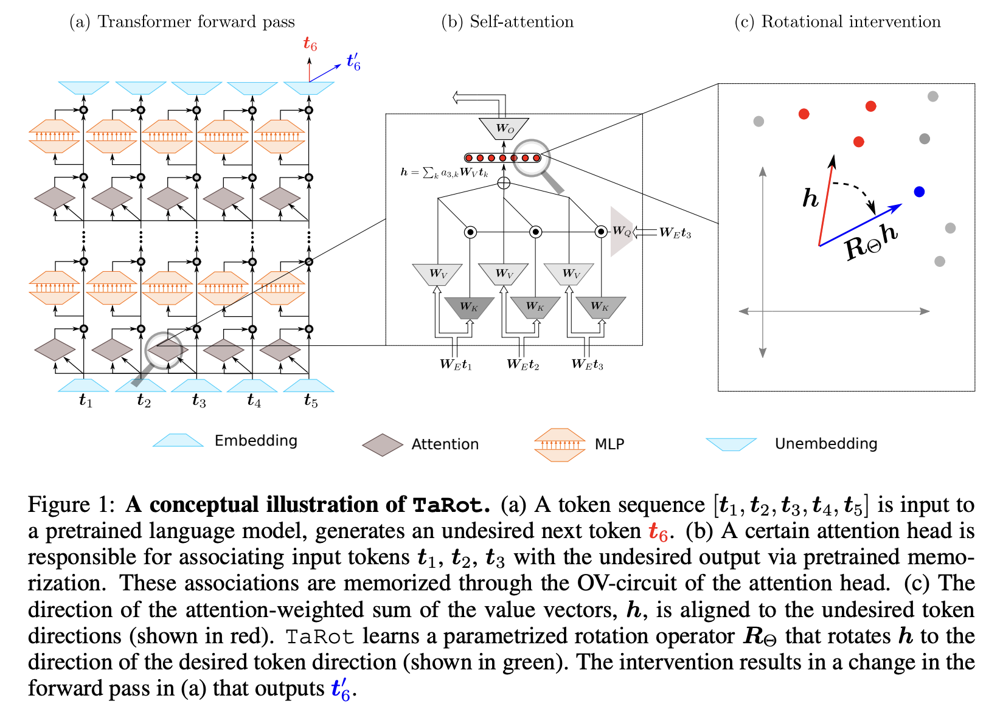

# TaRot

Code for the paper [MECHANISTIC BEHAVIOR EDITING OF LANGUAGE MODELS](https://arxiv.org/pdf/2410.04277)




## Train
`trainRotation_NN_kernel.py` is the main file to train the model. You can run the following command to train the model.

```
ython3 trainRotation_NN_kernel.py --model qwen_2 --layer 0 5 --angle_0 'neg 1/4' --angle_1 '1/4' --dataset 'color' --moduleType 'reasoning' --metric 'prob' --fewShotCategory 'mix' --trainingDataSize 20 --rotationMethod 'rotary'
```
where 
- model is the model name
- layer is the range of layers to be rotated
- angle_0 and angle_1 are the range of rotation angles
- dataset is the dataset to be trained on, 
- moduleType is which module should be rotated (reasoning corresponds to attention heads and MLP rotates the MLPs)
- metric is the metric to be used for the evaluation while training
- fewShotCategory is the few-shot category it can either be 0 shot, mix or 6 shot
- trainingDataSize is the number of training samples
- rotationMethod is the rotation method (rotary or givens).

## Evaluation
`evaluateRotation.py` is the main file to evaluate the model. You can run the following command to evaluate the model.
```
python3 evaluateRotation.py --model llama-3-8b --layer 0 16 --angle_0 'neg 1/6' --angle_1 '1/6' --dataset color --moduleType 'reasoning' --metric 'prob' --fewShotCategory 'mix' --rotationMethod 'rotary'
```
where
- model is the model name
- layer is the range of layers to be rotated
- angle_0 and angle_1 are the range of rotation angles
- dataset is the dataset to be evaluated on,
- moduleType is which module should be rotated (reasoning corresponds to attention heads and MLP rotates the MLPs)
- metric is the metric to be used for the evaluation while training
- fewShotCategory is the few-shot category used while training it can either be 0 shot, mix or 6 shot
- rotationMethod is the rotation method (rotary or givens) while training

## Generation Task
`train_summarization.py` is the main file to train the model for the summarization task
`test_summarization.py` is the main file to evaluate the model for the summarization task
`train_topic.py` is the main file to train the model for the topic classification task
`test_topic.py` is the main file to evaluate the model for the topic classification task

`train.sh` contains the commands to complete commands


## Dataset
We tested our model on the following datasets:
- Color Dataset (big bench)
- Navigate Dataset (big bench)
- entailed_polarity (big bench)
- winowhy (big bench)
- ag_news
- imdb
- toxicity

## Citation
If you find this code useful, please consider citing our paper:
```
@misc{singh2024mechanistic,
    title={Mechanistic Behavior Editing of Language Models},
    author={Joykirat Singh and Subhabrata Dutta and Tanmoy Chakraborty},
    year={2024},
    eprint={2410.04277},
    archivePrefix={arXiv},
    primaryClass={cs.CL}
}
```
